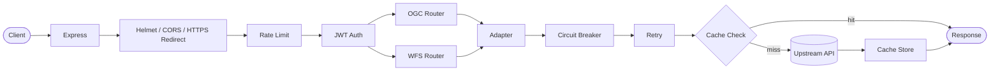
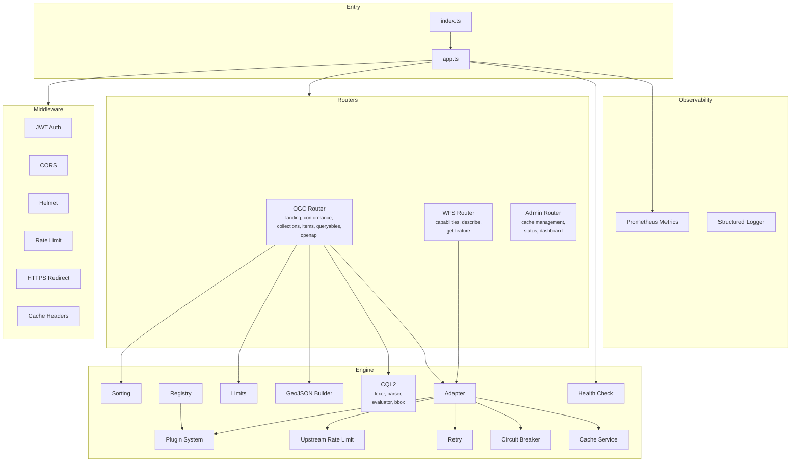
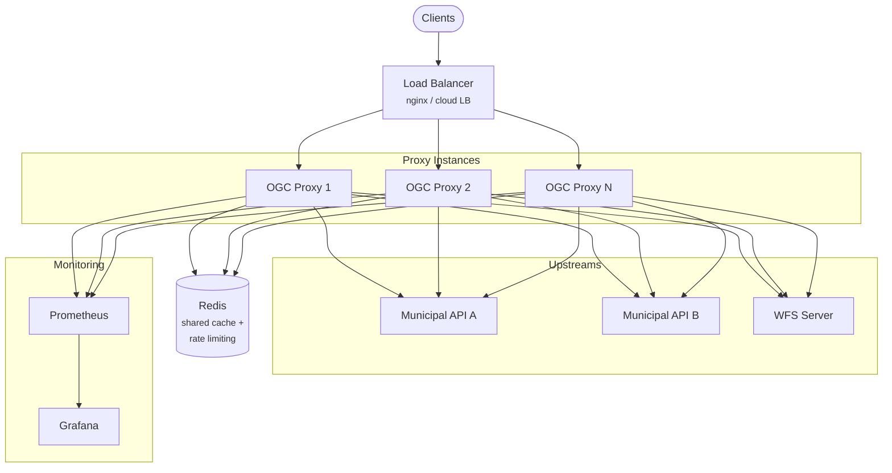

# Architecture

OGC API Features / WFS proxy for municipalities. Translates heterogeneous upstream APIs (REST, WFS) into a standards-compliant OGC API Features interface with optional WFS 1.1/2.0 compatibility endpoints.

## Request Flow

## Component Diagram

## Deployment Diagram

## Key Concepts

### Collection Configuration (YAML)

Collections are defined in a YAML file (`collections.yaml`) loaded by the registry at startup. Each collection declares its upstream source (URL, pagination strategy, response mapping), geometry type, property schema, and optional settings for caching, rate limiting, circuit breaking, and retry. Environment variables can be interpolated with `${VAR}` syntax. The configuration is validated at load time using Zod schemas.

### Plugin System

Plugins transform data at multiple points in the request lifecycle: incoming OGC request, outgoing upstream request, raw upstream response, individual features, and final OGC response. Plugins can be built-in (e.g., `wfs-upstream`), loaded from a `PLUGINS_DIR`, or referenced by file path. Each collection can specify a plugin by name in its YAML configuration.

### Caching

Responses are cached in Redis with a per-collection configurable TTL. Cache keys are derived from collection ID and hashed query parameters (offset, limit, bbox, upstream params). When Redis is unavailable, the proxy operates without caching -- there is no in-memory fallback. The admin router exposes endpoints for manual cache invalidation by collection or pattern.

### Rate Limiting

Two layers of rate limiting protect the system:

- **Client rate limit**: Express middleware using `express-rate-limit` with a Redis-backed store (shared across instances). Configurable window and max requests via environment variables.
- **Upstream rate limit**: Per-collection token bucket limiting requests to each upstream API. Configured per-collection in YAML (`rateLimit.capacity` and `rateLimit.refillRate`). Uses Redis for distributed state when available, falls back to in-memory buckets.
